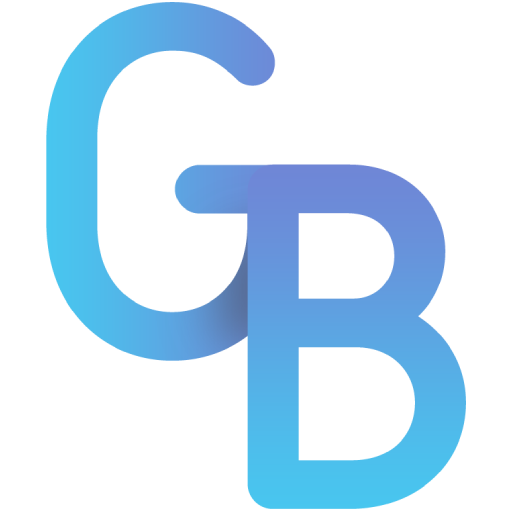

# gbkel-portfolio

  

	
	
	

That's my personal portfolio built in **ReactJS** with help of the framework **Gatsby**. It uses components made by **Ant Design**, icons provided by **Font Awesome** and **AWS Cloudfront** as CDN.

All the inspiration to make my portfolio's style came from [Novatics](https://www.novatics.com.br/en/).

Click [here](https://guilherr.me) to see my portfolio on live!
