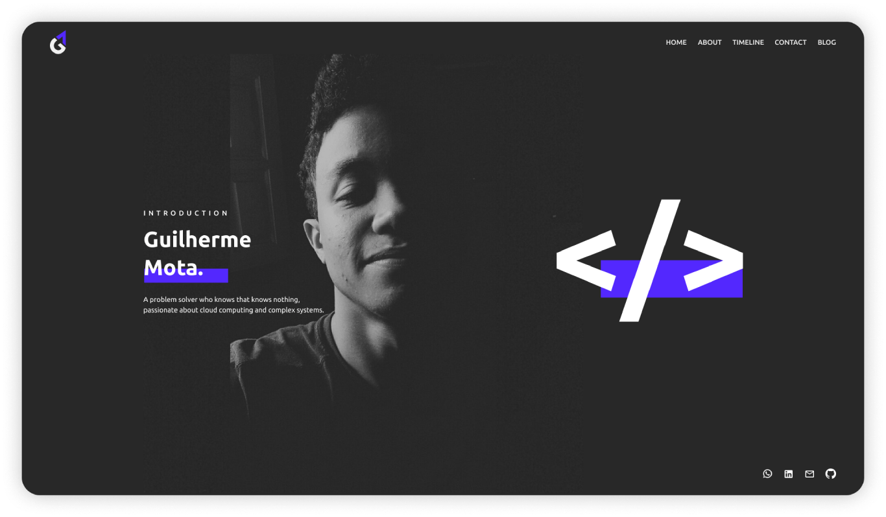

	

	

<h3 align="center">
  My personal website 💎
</h3>

	
	

	
	<a href="https://guilherr.me">Open Website</a>

## 📌 Overview

That's my personal website which I use to share some personal/professional info about me (like skills, job positions, etc) and show some posts on my blog.

You are able to see the newest version on **/app** folder. I usually make a new version per year and store the old ones on the **/old** folder.

## 🔧 Technologies

- Next.js
- React.js
- Typescript
- Styled Components
